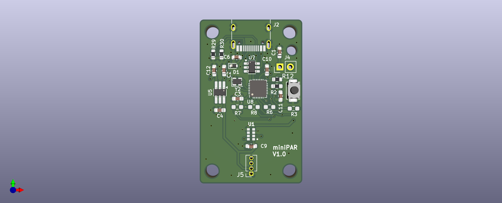

# Mini PAR meter - minimum tool to get a good numerical sense of light intensity

# Commands

* to be added

# Protocol 

* terminator: "\r"
* PAR uinits - µmol/m²/s"

FW Design (L. Caracciolo)
HW Design (L. Grabowski)
